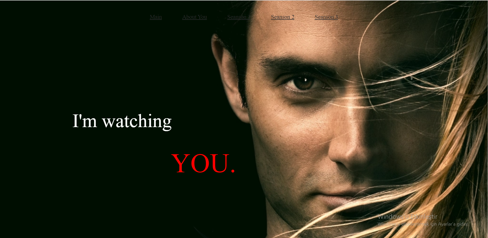
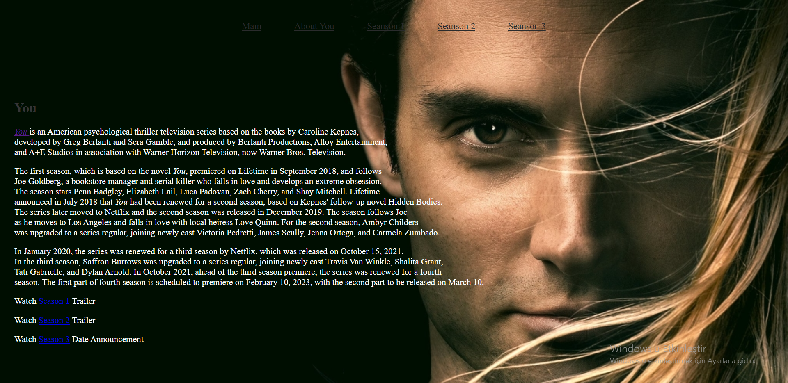

# CSS Ödev 1

* HTML sayfasını sıfırdan oluşturacaksınız. Eklemek istediğiniz ekstra özellikler tamamen size kalmış durumda.
* Sitemiz birkaç sayfadan oluşacak. Yani menü kısmında linkler vererek başka sayfaya geçilebilecek.
* Renkler tamamen sizin zevkinize kalmış durumda. Fakat renkler konusunda biraz yardım almak isterseniz Colorhunt renk paletleri konusunda muazzam bir site.
* Yazacağınız CSS etiketlerini Inline ve Internal yazabilirsiniz. External kullanmak tamamen sizin tercihinizdir.
* CSS yazarken noktalı virgülleri unutmayın. Biliyorum unutacaksınız, olur böyle şeyler...
* CSS ile ilgili yardımcı kaynak için w3schools.com'un CSS tutorialını, Türkçe kaynak için Fatih Hayrioğlu'nun web sitesini kullanabilirsiniz.
* Kendini tekrar eden yapılar kullanmamaya özen gösteriniz. Ya da kendini tekrar eden yapılarda kullandığımız özelliği kullanın. (İpucu: Inline(Etikete Özel), Internal(Aynı Dosyada) ve External(CSS Dosyasında) CSS Kullanımı)
* Sayfalarınızda kullandığınız fontlar için daha önce de videolarda bahsettiğimiz Google Fonts'u kullanabilirsiniz.
* Ana sayfada bulunan listelerin noktalarını ortalamak için list-style-position: inside'i kullanabilirsiniz.

Bu ödevde sizlerden istediğimiz hayal gücünüzü kullanarak öğrendiğiniz ve araştırarak bulduklarınızla birlikte güzel bir site oluşturmanız.

# CSS Ödev 1 Cevap
### Main Page

### About Us

### Season 1

### Season 2

### Season 3

## Patika Profilim

[Patika linki](https://app.patika.dev/melisaesenn)