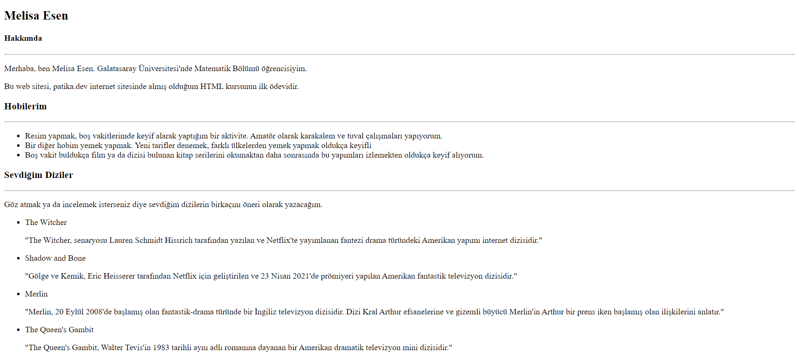

# HTML Ödev 1

## İlk Web Sayfamızı Oluşturmak

 Bu ödevde bir web sayfası tasarlayacağız.

* Siteyi açtığımızda adınız ve soyadınızı başlık şeklinde göstermeniz gerekiyor.
* Ad-Soyadın altında alt başlık olarak Hakkımda yazmalıdır.
Altına paragraf içerisinde neler yaptığınızı ve nelerden hoşlandığınızı yazabilirsiniz.
* Web sitenizi kaydederken dosya adı olarak 'index.html' seçmeniz gerekmektedir.
* Yazdığınız kodları açıklayan yorum satırları eklemeyi unutmayın.
 
## HTML Ödev 1 Cevap

## Patika Profilim

[Patika linki](https://app.patika.dev/melisaesenn)

