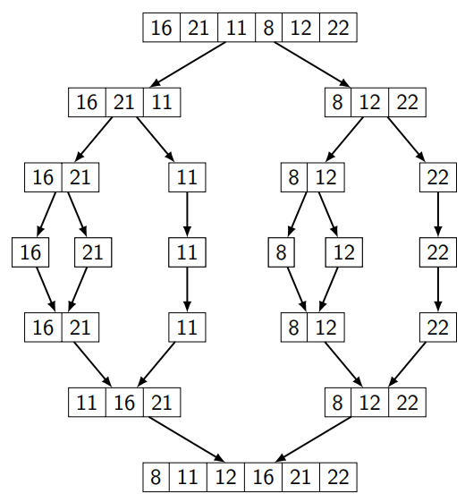

# Merge Sort Projesi
[16,21,11,8,12,22] 

1. Yukarıdaki dizinin merge sort türüne göre aşamalarını yazınız.
2. Big-O gösterimini yazınız.

# Merge Sort Projesi Cevap

[16,21,11,8,12,22] 

1. Yukarıdaki dizinin merge sort türüne göre aşamalarını yazınız.

    Cevap: 

2. Big-O gösterimini yazınız.

    Cevap: n tane sayı içeren bir sayı dizisi olduğunu kabul edelim. Bu n sayı içeren dizinin merge sort için best, average ve worst case durumları aynıdır. Merge sort için time comlexity O($n.log(n)$)'dir.
